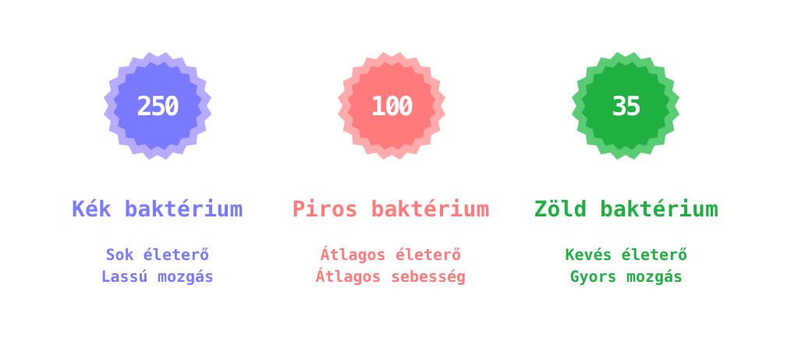

# Katalogus

**Team Catalog**:

- Gutai Dénes | [@daenash](https://szofttech.inf.elte.hu/daenash)
- Pethő László | [@hwrz1k](https://szofttech.inf.elte.hu/hwrz1k)
- Várnai Dávid | [@g5dpp6](https://szofttech.inf.elte.hu/g5dpp6)

# Project Influenza (tervezési vázlat)

**Tartalom**:

1. [Felhasználói felület](#felhasználói-felület)
2. [Pályák](#pályák)
3. [Ellenfelek](#ellenfelek)
4. [Tornyok](#tornyok)

---

## Felhasználói felület

1. Menü
   - Pályák listája
2. Játék felület
   - Pálya és játéktér
   - Vásárlási felület
   - Toronyfejlesztő felület
   - Ellenfél hullámok jelölője

---

## Pályák

Minden pálya fix (n x n)-es mátrix.

**Felépítési rétegek**:

1. Pálya Grid spriteokkal.
2. Mozgásra és animációkra szolgáló réteg

**Tulajdonságok**:

- 1\. réteg - Minta – `design` - A pálya minden egyes egységnyi területének a típusát leíró mátrix.

  _Ötlet: Felcímkézni `0`-val azokat a területeket ahová nem lehet tornyot építeni, `1`-el hova lehet, illetve spriteokat rendelni mindezekhez. Az útnak azért nem kellene külön számozott értéket adni, mert egy másik rétegen mozog az ellenfél, és végérvényesen a griden az egy olyan mező, ahová tornyot nem lehet építeni. (Implementációkor osztályokra bontva a pálya egységei a szebb kódért) Például:_

  ```java
  // Ezek itt mind a desing-tól függnek

  r = "...path/to/road.png"      // Az út felülete
  c = "...path/to/concrete.png"  // Beton felület
  p = "...path/to/platform.png"  // Platform felület

  [
    [(0,c),(0,c),(0,c),(0,c),(0,p)]
    [(0,c),(0,c),(0,c),(0,c),(0,c)]
    [(0,c),(1,p),(1,c),(1,p),(0,c)]
    [(0,r),(0,r),(0,r),(1,p),(0,c)]
    [(1,c),(1,p),(0,r),(1,p),(0,c)]
    [(0,c),(1,c),(0,r),(1,c),(0,c)]
  ]
  ```

- 2\. réteg - Út - `path` - Az útvonal amin az ellenfelek mozognak.

  _Ötlet: Lineáris mozgást leíró tömb, amelyben rendezett páronként találhatók az mozgási végpontok koordinátái. Például:_

  ```java
  [
     (0,10),     // <- Az első elem a kezdőpont
     (120,10),   // X tengely irányú mozgás (120px)
     (120,70)    // Y tengely irányú mozgás (60px)
  ]
  ```

---

## Ellenfelek

Az ellenfelek egy kötött pályán mozognak a kezdőponttól a cél felé. Minden újrakirajzoláskor kiszámolódik, hogy éppen hol tart százalékosan a pályán. Ha eléri az 1-et, ami a pálya vége, akkor a megmaradt életerejével megegyező sebzést végez a játékosra. Ha több sebzést kapott mint amennyi életereje van, elpusztul, és az életerejével megegyező Korona üti a játékos kezét.

_Kinézetek V1_:

(Az ellefnelekbe írt számok az életerejüket jelzik.)



**Tulajdonságaik**:

- Életerő - `hp` - Az ellefnél életereje, ennyi sebzést kell elszenvednie, hogy elpusztuljon. Ha elpusztult, ennyi _koronát_ kap a játékos.
- Gyorsaság - `speed` - Az egységnyi távolságot hány másodperc alatt teszi meg
- Kapott sebzés - `damageTaken` - Az elszenvedett sebzés. Ennek az adattagnak és az Életerőnek a különbségéből derül ki, hogy elpusztult-e az ellenfél
- Gyengítő módosítók - `drawbacks` - A tornyok speciális képességei által az ellenfélre rakott gyengítő módosítók. Ebben tárolódik az összes gyengítés amelyek időnkénti felülvizsgáláskor kerülhetnek le az ellenfélről, vagy sebezhetik azt.
- Kinézet - `spriteSrc` - Az ellenfél kinézetéhez szükséges spriteok elérési helye
- Haladás - `progress` - Az ellefélnek kijelölt útvonalon milyen távolságra van a céltól

---

## Tornyok

A tornyokat a vásárlási felületről lehet kiválasztani és a pályára helyezni. Lehelyezéskor mindig a torony által elfoglalt terület bal felső egysége lesz az _alappont_, abból látja a játékos hogy pontosan hova rakja majd a tornyot és annak mekkora a lőtávolsága. Lehelyezés után a torony amint ellenfelet lát a lőtávolságon belüli ellenfelek közül a célhoz legközelebbit fogja támadni. Minden találat után a sebzésével megegyező tapasztalatot szerez. Ha elegendő tapasztalatot szerzett, akkor fejleszthető. A fejlesztéséhez adott számú Korona szükséges

**Tulajdonságok**:

- Méret - `size` - A torony által a pályán elfoglalt terület mérete egységekben. (pl.: 2 x 2)
- Lövés gyakorisága - `rate` - A torony lövéseinek gyakoriságát adja meg. Egy egés szám, annyi miliszekundumnak kell eltelnie, hogy ismét lőhessen
- Lőtáv - `range` - A torony látótávolsága pixelekben megadva. Ezen sugarú körben elhelyezkedő ellenfeleket tudja eltalálni. (Fontos, hogy a range a torony középpontjától érvényes, tehát azt mindenképpen ki kell kalkulálni amikor lehelyeződik)
- Ár - `price` - A torony vásárlásához szükséges Korona mennyisége.
- Fejlesztési ár - `upgradePrice` - A torony fejlesztéséhez szükséges Korona mennyisége.
- Fejlesztési tapasztalati küszöb - `upgradeXpTreshold` - A torony fejlesztéséhez szükséges tapasztalat mennyisége.
- Sebzés - `damage` - A torony egy lövése által okozott sebzés mértéke
- Tapasztalat - `xp` - A torony tapasztalati pontja. Ha ez elér egy bizonyos értéket, akkor van lehetőség fejleszteni a tornyot
- Speciális képesség - `specialType` - A fejlesztéskor kiválasztott speciális képesség típusa. ( Ha ez ki van töltve, akkor a a torony sebzési metódusa módosul )
- Alappont - `base` - A torony pályára helyezett bal felső indexe. ( pl.: (2,8), ahol a 2 a pályamátrix sora - 1, a 8 a pályamátrix oszlopa - 1 (-1 a tömb indexelés miatt))

### **Tornyok fajtái**

#### Fehérvérsejt (Leukocyte)

_Alaptulajdonságai:_

1. Sebzés: alacsony
2. Lövés gyakorisága: magas
3. Lőtáv: közepes

_Fejlesztések:_

1. A torony lőtáv tulajdonsága magassá válik
2. Ha eltalál egy ellenfelet, lassítja 5 másodpercig

#### Gyógyszer (Medicine)

_Alaptulajdonságai:_

1. Sebzés: magas
2. Lövés gyakorisága: alacsony
3. Lőtáv: közepes

_Fejlesztések:_

1. A torony lövéseinek gyakorisága közepessé válik
2. Ha eltalál egy ellenfelet, folyamatos tűz sebzést rak rá

#### Alkohol (Alcohol)

_Alaptulajdonságai:_

1. Sebzés: közepes
2. Lövés gyakorisága: magas
3. Lőtáv: alacsony

_Fejlesztések:_

1. A torony sebzés tulajdonsága magassá válik
2. Ha eltalál egy ellenfelet, az az ellenfél kétszeres sebzést szenved onnantól minden torony lövésre

**Torony lehehelyézse**:

Torony lehelyezésekor vizsgálni kell, hogy a torony méretének megfelelő hely rendelkezésre áll-e a táblán. A bal felső sarka lesz a toronynak az alappont és a méretétől függően ahhoz viszonyítjuk a pályán való lerakás lehetőségét

**Ellenfél lőtávolságon belül tartózkodásának számolása**:

_Az alábbi adatstruktúrák még tervezés alatt vannak!_

- **Először meghatározzuk a torony középpontját.**

  Szükséges adatok a torony alappontja (`base`), a mérete (`size`), illetve a pálya alapvető egységnyi mértékegysége (`unit`). Az alappont és az egység megadja a kezdő koordinátát. A kezdő koordinátából, a torony méretből és az egységből pedig már megadható a középpont.

  ```java
  // base = [2,3] -> a torony a 3. sor 4. oszlopában kezdődik (0-s indexelés)
  // size = [2,2] -> a torony 2 x 2 egységet foglal el a pályán
  // unit = 20 -> egy egység 20px nagyságú horizontálisan és vertikálisan is

  centerX = base[0] * unit + size[0] / 2 * unit // = 60
  centerY = base[1] * unit + size[1] / 2 * unit // = 80
  ```

- **Kiszámoljuk a torony és az ellenfél közti távolságot**

  Adott a torony és az ellenfél középpontja is, ezekből a háromszög egyenlőtlenséggel megadható a távolság

  ```java
  // towerCenter = [60,80]
  // enemyCenter = [10,30]

  a = Math.abs(towerCenter[0] - enemyCenter[0]) // = 50
  b = Math.abs(towerCenter[1] - enemyCenter[1]) // = 50
  c = Math.sqrt(a^2 + b^2) // = 70,7106781187
  ```

- **Összehasonlítás**

  Az ellenfél és a torony közti távolságot összehasonlítjuk az ellenfél nagyságának (`size`, ez a sugara) és a torony lőtávolságának (`range`, ami szintén a középpontból mért sugár) összegével. Ha az összeg nagyobb vagy egyenlő, akkor olyan közel vannak egymáshoz, hogy a torony el tudja találni az ellenfelet.

  ```java
  const canHitTarget = size + range >= distance ? true : false
  ```
